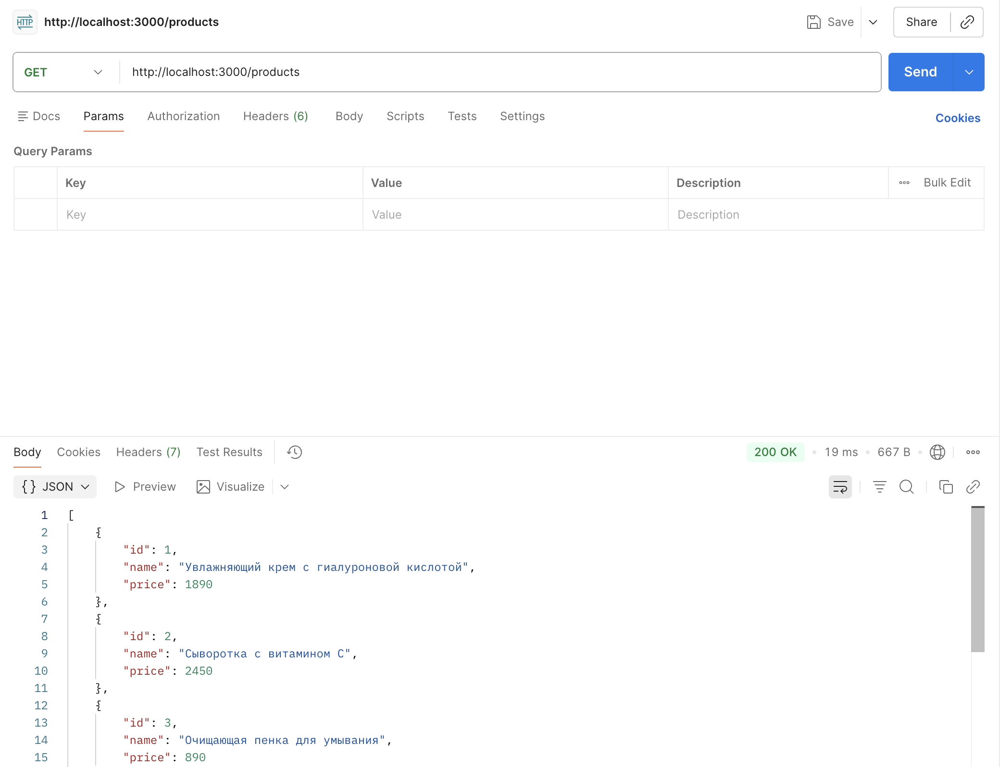
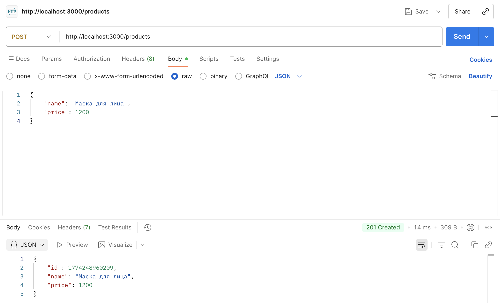
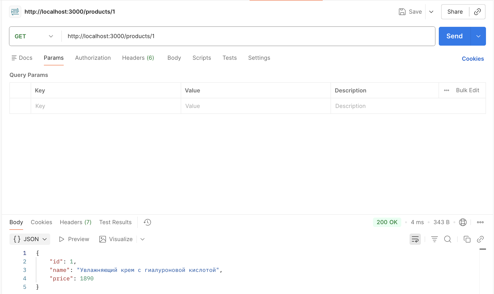
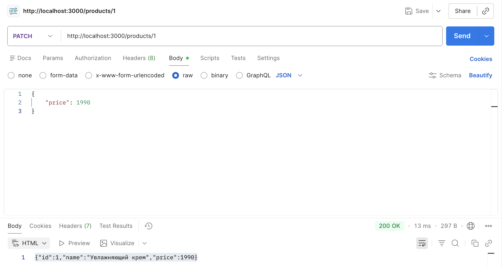
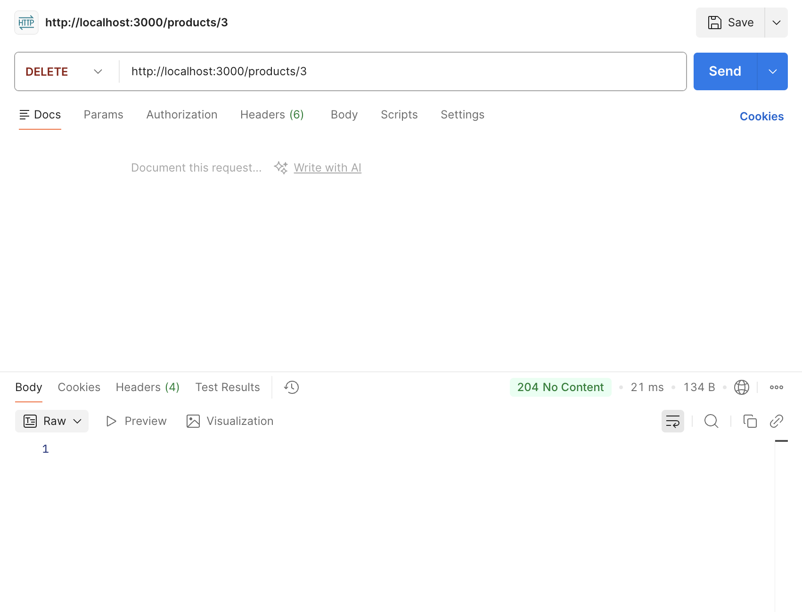
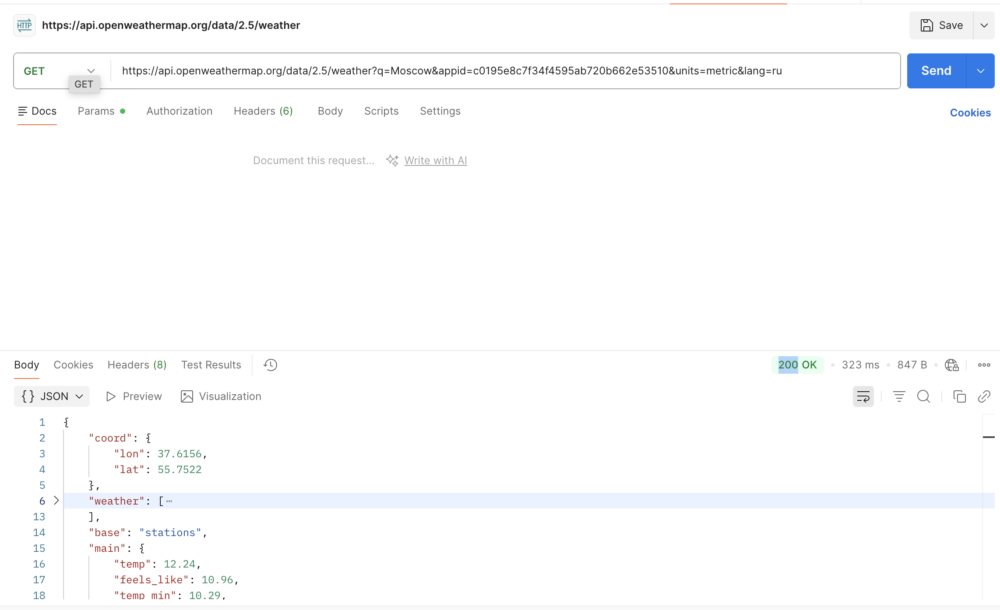
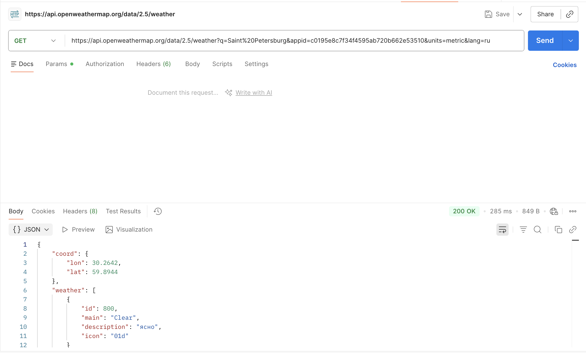
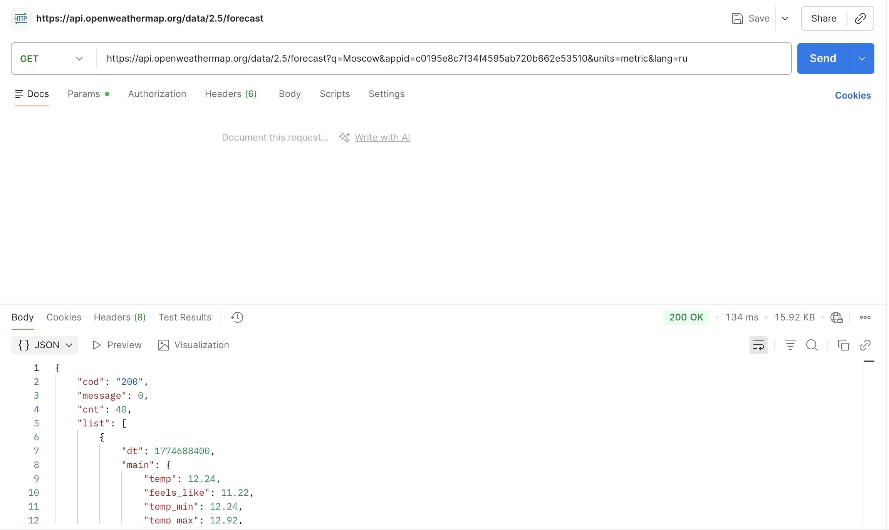
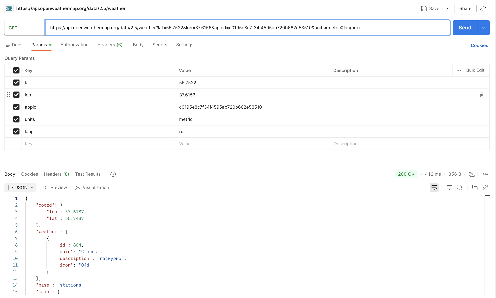
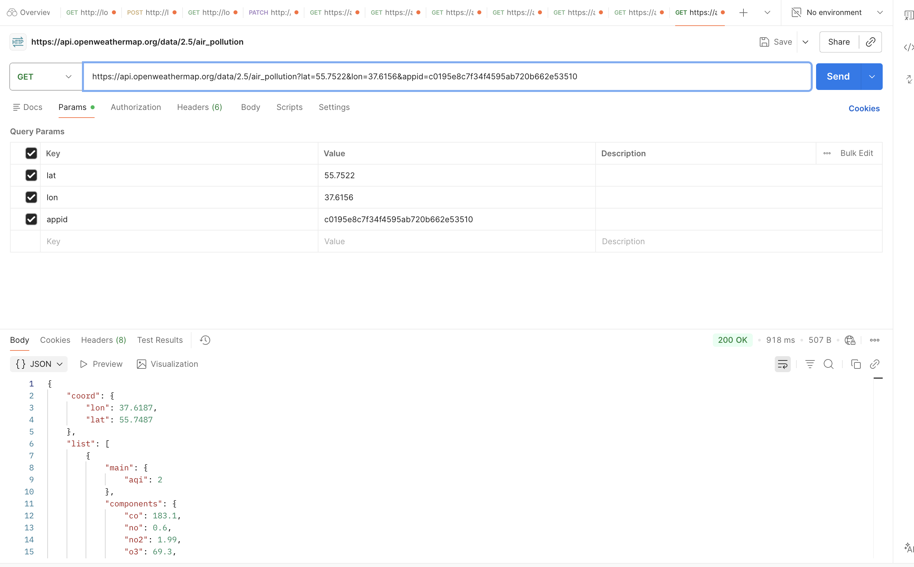

# Практическая работа №3
## JSON и внешние API

**Студент:** [Ичкеева Софья]
**Дата:** 28.03.2026

---

## Часть 1: Тестирование моего API в Postman

### Запрос 1: GET /products (все товары)

### Запрос 2: POST /products (создать товар)

### Запрос 3: GET /products/1 (товар по ID)

### Запрос 4: PATCH /products/1 (обновить цену)

### Запрос 5: DELETE /products/3 (удалить товар)

---

## Часть 2: Внешнее API (OpenWeatherMap)

### Запрос 1: Погода в Москве

### Запрос 2: Погода в Санкт-Петербурге

### Запрос 3: Прогноз на 5 дней

### Запрос 4: Погода по координатам

### Запрос 5: Качество воздуха

---

## Вывод

Все запросы выполнены успешно. API работает корректно.